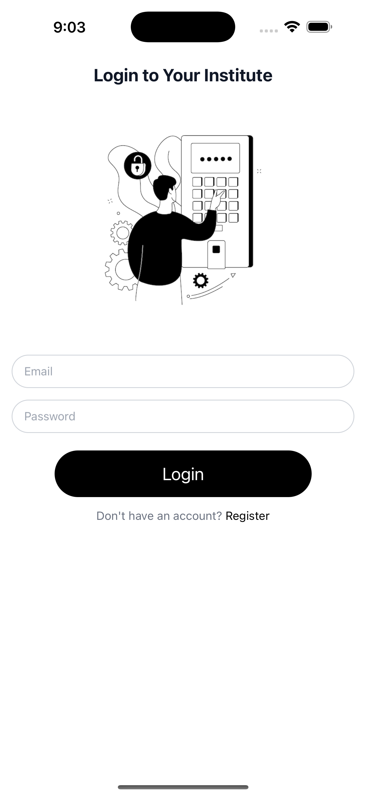
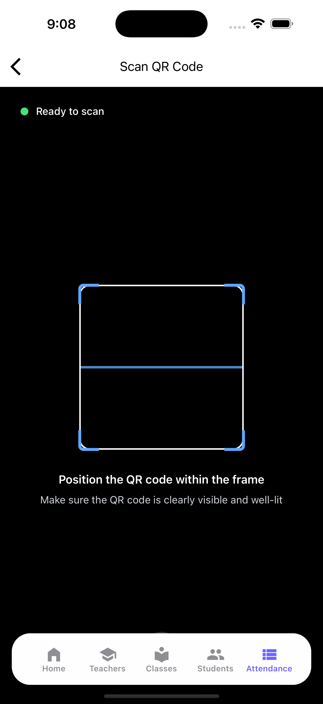

# 📌 Attendance App

An attendance management system built with **React Native (Expo)** and **Firebase**, featuring QR code scanning, real-time updates, and secure authentication.

---

## 🚀 Features

* 🔑 **User Authentication** – Sign up, login, and logout with Firebase Auth
* 📷 **QR Code Scanner** – Mark attendance quickly by scanning class-specific QR codes
* ☁️ **Cloud Integration** – Firebase Firestore for real-time data storage
* ☁️ **Teacher, Student, Class, Attendance** – CRUD operation done

---

## 🛠️ Tech Stack

* **Frontend:** React Native (Expo)
* **Navigation:** Expo Router
* **Authentication:** Firebase Auth
* **Database & Storage:** Firebase Firestore & Storage
* **QR Code Scanning:** Expo Camera

---

## 📂 Project Structure

```
attendance-app/
│── app/                 # App screens & routes
│   ├── (auth)/          # Login & Signup
│   ├── (dashboard)/     # Student & Admin dashboards
│   └── ...
│── context/             # Auth & global context
│── services/            # Firebase & API services
│── components/          # Reusable UI components
│── assets/              # Images, icons, etc.
│── package.json
│── README.md
```

---

## ⚙️ Installation & Setup

1. **Clone the repository**

   ```bash
   git clone https://github.com/kavee137/CloudAttend/tree/recover-yesterday
   cd attendance-app
   ```

2. **Install dependencies**

   ```bash
   npm install
   # or
   yarn install
   ```

3. **Configure Firebase**

   * Create a Firebase project in [Firebase Console](https://console.firebase.google.com/)
   * Enable **Authentication**, **Firestore**, and **Storage**
   * Add your Firebase config to `.env` file:

     ```env
      EXPO_PUBLIC_EMAILJS_SERVICE_ID=
      EXPO_PUBLIC_EMAILJS_TEMPLATE_ID=
      EXPO_PUBLIC_EMAILJS_PUBLIC_KEY=
     ```

4. **Run the project**

   ```bash
   npx expo start
   ```

---

## 📸 Screenshots

| Login Screen                           | Dashboard                                      | QR Scanner                              |
| -------------------------------------- | ---------------------------------------------- | --------------------------------------- |
|  |  |  |

---

## 👨‍💻 YT video
https://youtu.be/qg0ZvAOr_gk

## 👨‍💻 Contributing

Contributions are welcome! Please fork this repo and submit a PR for any improvements.

---

## 📜 License

This project is licensed under the **MIT License**.
